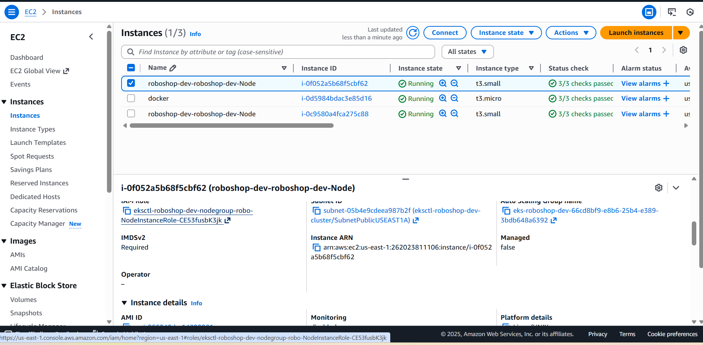
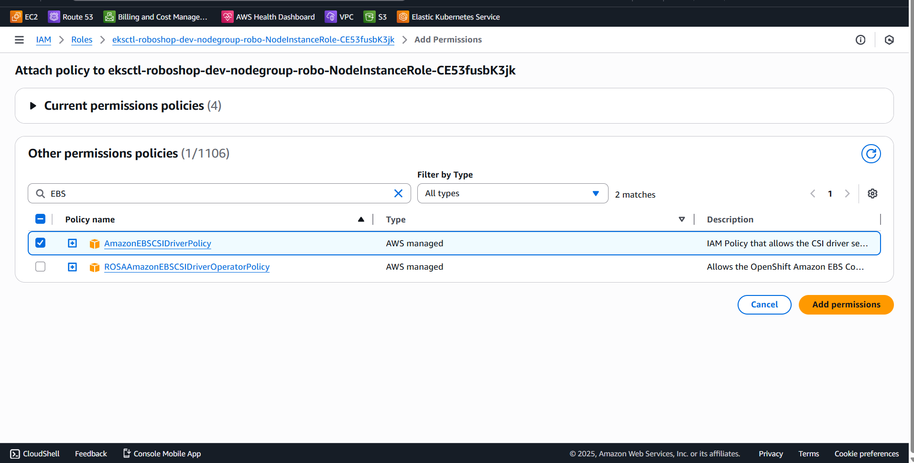
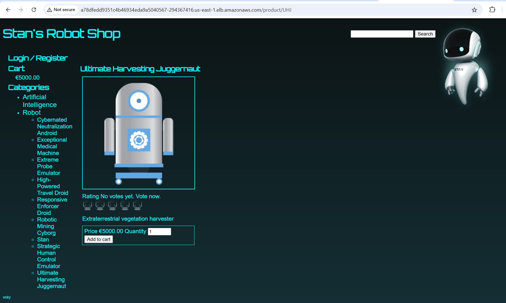
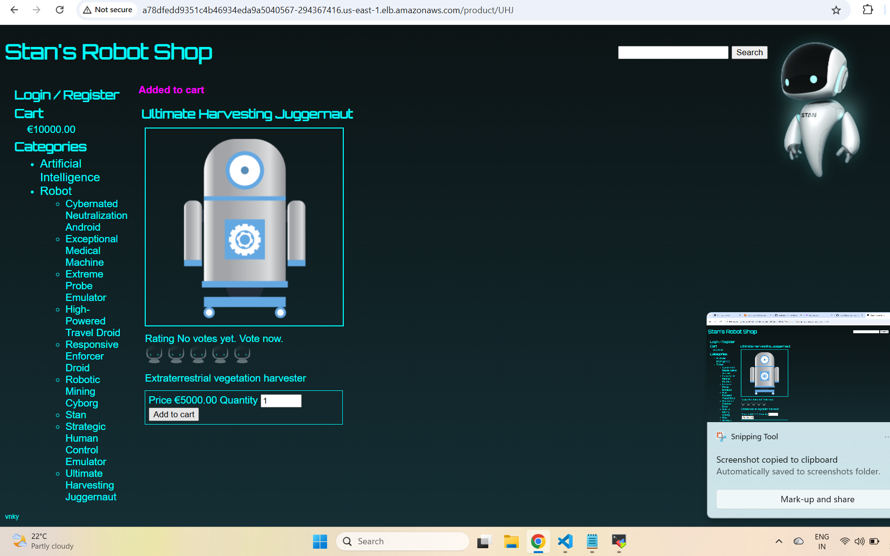
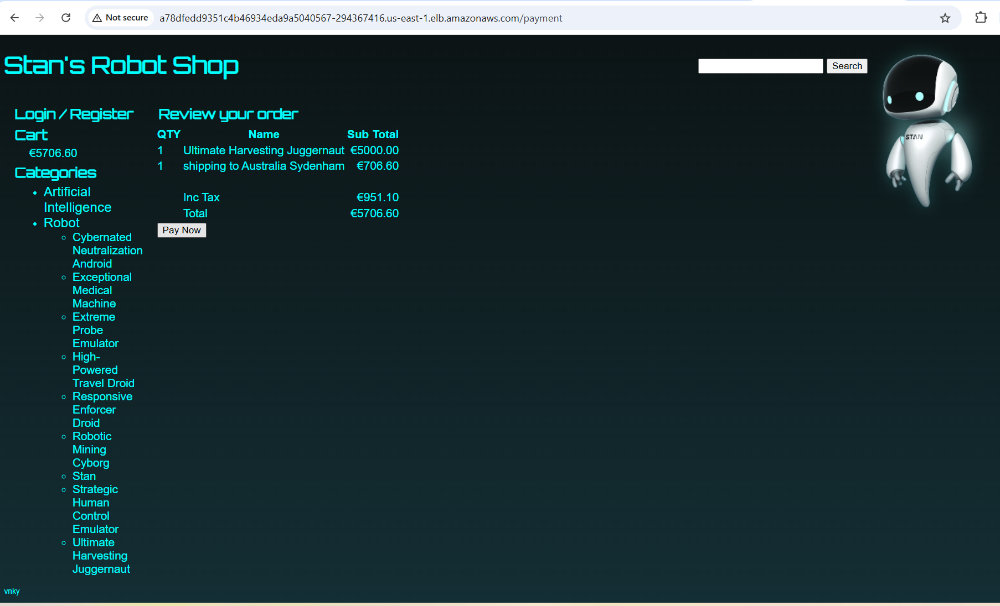
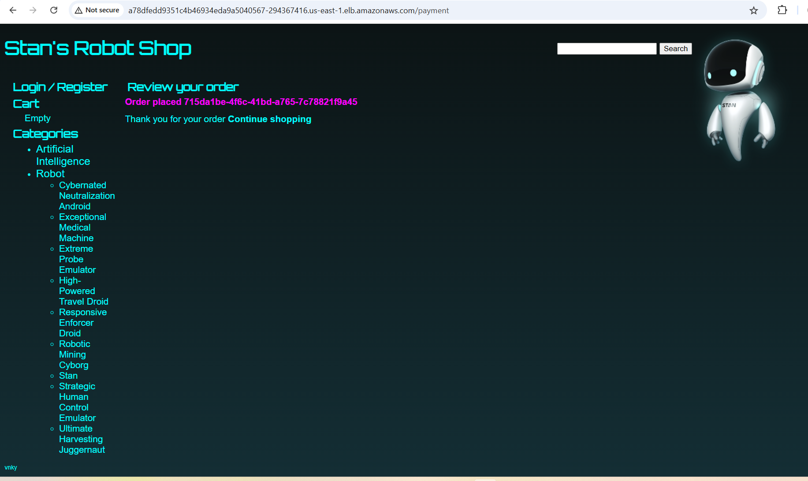
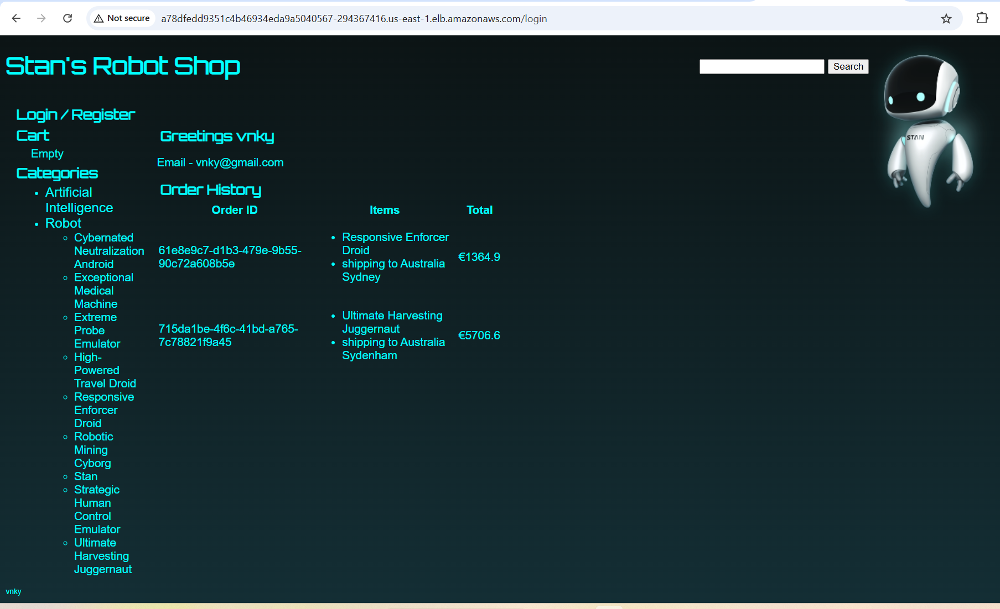

# Roboshop Deployment on AWS EKS using Helm

This repository contains Helm charts to deploy the **Roboshop microservices application** on **AWS EKS**.

---

## Prerequisites

- AWS EKS cluster running
- Worker nodes with IAM policy attached:
  ```
  AmazonEBSCSIDriverPolicy
  ```
- kubectl configured
- helm installed
- Git installed

Pic :
---

---

---

---

## 1. Install AWS EBS CSI Driver

Required for MongoDB and MySQL persistent volumes.

```bash
kubectl apply -k "github.com/kubernetes-sigs/aws-ebs-csi-driver/deploy/kubernetes/overlays/stable/?ref=release-1.53"
```

Verify:
```bash
kubectl get pods -n kube-system | grep ebs
```

---

## 2. Create Namespace

```bash
kubectl apply -f namespace.yml
```

Verify:
```bash
kubectl get ns
```

---

## 3. Create StorageClass

```bash
kubectl apply -f roboshop-ebs-sc.yml
```

Verify:
```bash
kubectl get storageclass
```

---

## 4. Install Helm (Skip if already installed)

```bash
curl -fsSL -o get_helm.sh https://raw.githubusercontent.com/helm/helm/main/scripts/get-helm-4
chmod 700 get_helm.sh
./get_helm.sh
```

Verify:
```bash
helm version
```

---

## 5. Deploy Databases (FIRST)

### MongoDB
```bash
cd mongodb
helm upgrade --install mongodb . -n roboshop
```

### MySQL
```bash
cd ../mysql
helm upgrade --install mysql . -n roboshop
```

Verify:
```bash
kubectl get pods -n roboshop
kubectl get pvc -n roboshop
```

---

## 6. Deploy Cache and Messaging Services

### Redis
```bash
cd ../redis
helm upgrade --install redis . -n roboshop
```

### RabbitMQ
```bash
cd ../rabbitmq
helm upgrade --install rabbitmq . -n roboshop
```

---

## 7. Deploy Application Services

```bash
cd ../catalogue
helm upgrade --install catalogue . -n roboshop
```

```bash
cd ../cart
helm upgrade --install cart . -n roboshop
```

```bash
cd ../user
helm upgrade --install user . -n roboshop
```

```bash
cd ../shipping
helm upgrade --install shipping . -n roboshop
```

```bash
cd ../payment
helm upgrade --install payment . -n roboshop
```

Verify:
```bash
kubectl get pods -n roboshop
kubectl get svc -n roboshop
```

---

## 8. Deploy Frontend (LAST)

```bash
cd ../frontend
helm upgrade --install frontend . -n roboshop
```

---

## 9. Access Frontend

If frontend service is NodePort:

```bash
kubectl get svc frontend -n roboshop
```

Access in browser:
```
http://<EC2_PUBLIC_IP>:<NodePort>
```

Example:
```
http://3.237.186.145:30080
```

---

## 10. Useful Commands

```bash
kubectl get pods -n roboshop
kubectl get svc -n roboshop
kubectl get pvc -n roboshop
helm list -n roboshop
```

---

## 11. Uninstall a Service

```bash
helm uninstall <release-name> -n roboshop
```

Example:
```bash
helm uninstall frontend -n roboshop
```

---

## Correct Deployment Order

1. Namespace  
2. StorageClass  
3. MongoDB  
4. MySQL  
5. Redis  
6. RabbitMQ  
7. Catalogue  
8. Cart  
9. User  
10. Shipping  
11. Payment  
12. Frontend  

---

## Notes

- `Chart.yaml` must be named exactly (case-sensitive)
- Run Helm commands from chart root, not templates/
- t3.micro nodes may cause IP exhaustion; use t3.medium or higher

---


---

---

---

---

---


# Before Creating:
``` bash 
kubectl apply -f eks.yml

kubectl apply -f namespace.yml

kubectl apply -f roboshop-ebs-sc.yml

```
---
## To Create At One time : 

``` bash
   for i in  mongodb redis mysql rabbitmq catalogue user cart shipping payment frontend;do cd $i; helm install $i .;cd ..;done

```

## To delete  At One time : 

``` bash
  - for i in  mongodb redis mysql rabbitmq catalogue user cart shipping payment frontend;do cd $i; helm uninstall $i .;cd ..;done

```

---


# Deletion :
``` bash 

kubectl delete -f roboshop-ebs-sc.yml

kubectl delete -f namespace.yml

kubectl delete -f eks.yml

``` 